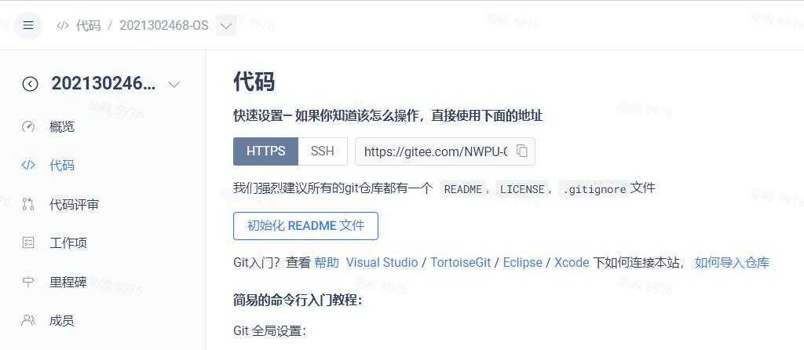

# 2024 OS 试点班小实验

该仓库提供各次小实验的基准代码，每次小实验会在 repo 的各分支发布，如第一次实验将发布在 lab1 分支，依此类推。

## 准备工作

进入侧边栏的 **代码** 页面，点击新建仓库并保证以下内容：

- 仓库名称：`<学号>-OS`（如 2022666666-OS）
- 可见性：私有
- 简介：随便写
- 其余部分**必须**保持默认

创建完成后应如下所示：



复制 repo url，在本地找个好位置用于开展实验。

在选定的目录打开终端，执行：

> 假定你得到的 url 为 https://gitee.com/NWPU-OS-EXTRA2024/2022306666-OS.git
>
> 假定你存放仓库的目录为 my-os-labs
>
> 请自行替换命令中的 repo url 和工作目录

```sh
git clone https://gitee.com/NWPU-OS-EXTRA2024/os-labs.git my-os-labs
cd my-os-labs
git remote set-url --push origin https://gitee.com/NWPU-OS-EXTRA2024/2022306666-OS.git
```

## 开始实验

当你需要开始新实验时，拉取更新并切换分支（以第三次实验 lab3 为例）：

```sh
git pull
git switch lab3
```

完成实验后，暂存你的更改并提交，推送：

```sh
git push
```

> 请自行学习如何暂存更改并提交

## 说明

**P1**

非必要别往仓库提交构建文件

**P2**

恰当地拆分你的更改并提交，避免一次性提交全量更改

**P3**

你最终的实验结果应当与基准代码保持一样的代码结构与项目结构

若你坚持差异化实现，你应当满足以下任一条件：

- 提供了更为精简的项目结构
- 提供了更为稳健的构建流程
- 提供了更为便捷/强大的执行过程
- 提供了更为高效或格式更为统一的代码

并满足以下所有条件：

- 提供能够完整运行你的代码的说明
- 能够完整且原样地实现实验所要求的内容
