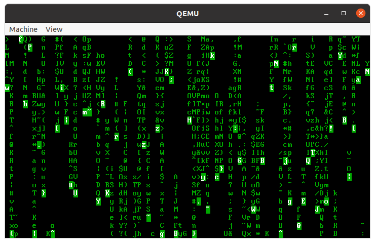
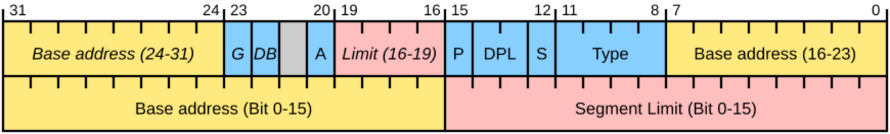
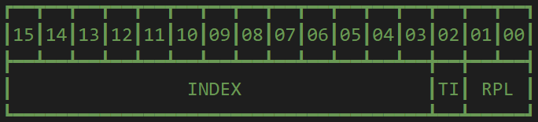

<div align="center">
    <font size="6">实验三 MBR 与保护模式</font>
</div>

<div align="center">
    <font size="4">谷建华</font>
</div>
<div align="center">
    <font size="4">2024-10-14 v0.5</font>
</div>

# 实验目的

1. 学习 x86 保护模式编程及如何从实模式进入到保护模式
2. 学习汇编与 C 之间的相互调用
3. 学习 MBR 和磁盘分区

# 实验预习内容

1. 进入保护模式之前需要做的准备工作
2. MBR 分区格式
3. 应用程序二进制接口 ABI

# 实验内容以及步骤

1. 制作 MBR 格式的分区硬盘，编写 MBR 引导程序使其能够解析分区表

    (1) 新建一个空的磁盘映像并使用 fdisk/cfdisk 工具进行分区，然后使用 `losetup` 和 `mkfs` 工具将这些分区格式化为对应的格式，并使用 `fdisk -l disk.img` 检查磁盘的分区情况

    (2) 从 `mbr.asm` 编译 MBR 程序并写入磁盘，挂载启动并验证 MBR 程序被正确加载执行，你应当能够看到 `Find Part` 和 `No Bootable`

    (3) 修改 MBR 程序使其能够打印各个分区的 **分区类型** 和 **起始扇区 LBA**，即 4 个分区的总计 8 个数字

    (4) 修改 MBR 程序使其能够搜索到第一个 **活动主分区** 并从该分区加载 boot 并启动，你应当能够看到 `Hi~` 和 `???`

    (5) 修改 `boot.asm` 使其能够打印自己所在的主分区的序号，你需要着重考虑如何在 boot 中获取该信息

    (6) 变更磁盘上的第一个活动主分区，即更改分区表上的活动分区标志，重新尝试步骤 5，验证你成功地从不同分区加载启动

    注意：对于步骤 4，打印的主分区序号应当是从 0 开始计数的

    提示：对于步骤 6，你可以手动修改 `disk.img` 的分区表，也可以通过修改 `part.sfdisk` 并重新构建镜像

    注意：对以上所有内容，你应当优先使用提供的 Makefile 进行操作，向你提供的 Makefile 保证是稳定且健全的，实验中任何可能需要执行命令的地方总是可以通过 Makefile 所提供的目标完成

2. 修改 `boot.asm`，完成从分区的磁盘上完成内核启动

    (1) 由于分区的出现，你需要对 `boot.asm` 稍作修改以正确加载 loader，完成后，你应当能够看到输出从 `???` 变更为 `kprintf is invoked somewhere`

    (2) 结合 GDB，验证 boot 成功加载了 loader 并由 loader 在成功加载 kernel 后进入内核

    说明：本任务的主要目的在于观察从分区启动并进入内核的过程，若你在任务 1 中完成得较好，此任务中应该能够无伤速通

3. 通过修改 `kprintf.asm`，完成 kprintf 函数的汇编实现

    (1) 对于第 0 个参数，使其为输出位置

    (2) 对于第 1 个参数，使其为格式化字符串的首地址

    (3) 对于剩余的变参，顺次填充格式化字符串中指定的模式，需要实现的模式如下：

    - `%c` 对应参数传递 ASCII 值，取值 0~127，输出对应的字符并将输出位置移动到下一位
    - `%f` 对应参数传递颜色码，取值 0~15，将之后输出的字符的前景色变更为对应值
    - `%b` 对应参数传递颜色码，取值 0~15，将之后输出的字符的背景色变更为对应值
    - `%s` 对应参数传递 `colored_char` 结构体，按结构指定的数据及状态输出字符

    (4) 对于其他字符，直接按 ASCII 码输出，并将输出位置移动到下一位

    (5) 依据 `start.c` 中提供的测例自检方法实现是否正确

    (6) 在 `start.c` 中接入 `cmatrix.c` 中的 `cmatrix` 方法，使其能够得到以下效果

    

    注意：对于每次 `kprintf` 调用，初始的默认字符颜色总是为黑底白字

    说明：对于步骤 1，你可以假定屏幕大小固定为 `80×25`，则入参 0 代表 `row=0,col=0`，入参 80 代表 `row=1,col=0`，入参 531 代表 `row=6,col=51`

    说明：对于步骤 3，模式 `%s` 为选做内容，`colored_char` 的结构见 `cmatrix.h`，结构体要求传递值而非传递结构体的地址；处理该模式时 `kprintf` 应独立执行，输出前后不改变原前景色、背景色、输出位置，如原本为 **黑底-白字-位置 16** 的状态，在处理完 `%s` 的输出后，下一个字符应当依旧按照 **黑底-白字-位置 16** 的状态输出；如果你期望检验该项选做内容是否实现正常，只需提供 `TEST_KPRINTF_S_PAT` 宏定义即可，如 `make run DEFINES=TEST_KPRINTF_S_PAT` 或在相关 Makefile 的 `DEFINES` 变量追加该宏定义

    说明：对于步骤 4，保证参数 1 提供的字符串中均为可打印字符，不含控制字符，且不含需要打印的 `%` 字符

    注意：GCC 包含内建方法 `__builtin_va_*` 用于辅助编写变参函数，但在这个实验中，我们并不需要且禁止你利用其完成函数实现，另一方面使用汇编实现 `kprintf` 同时也能够帮助你理解其底层原理

4. \[选做] 关于多分区启动的进阶内容

    (1) 修改 MBR 程序，打印所有扩展分区的 **起始扇区 LBA**

    (2) 允许用户选择 **任意主分区** 进行启动

    (3) 允许用户选择 **任意分区** 进行启动

    (4) 利用 C 编写一个分区表解析工具，使其可以根据 MBR 和磁盘内容输出每个分区的分区信息（含扩展分区）

    (5) 使用 GRUB 完成引导：在前面的任务中，我们都是手写的引导程序，但是实际上我们假设了非常理想的情况，如文件系统只有 FAT32，参数固定等等，如果换了一种硬件环境，那么重新适配的工作将会非常繁琐。不过已经有人写了 GRUB 工具，其可以适应多种情况，跳过前面的 boot 和 loader 直接加载内核。你需要探索如何用 GRUB 引导我们的内核，如果你想做这个任务但是不知道如何下手，请联系助教寻求帮助

    提示：你可以将所有的主分区都放上 `boot.bin`，然后借助 16h 键盘中断编写交互程序，让用户选择从哪个主分区启动

    注意：对于步骤 3，其或许无法在有限的 446 字节内实现，不过我们真的只有一个扇区吗？你可以联系助教讨论这件事情。当然，实用的 bootloader 不会选择这么做，此处仅仅提供一个思考与实践的方向

# 实验总结

1. 多分区下的 loader 加载与单分区的加载有何不同？在读取扇区时应当着重注意什么问题？
2. 在 loader 阶段都完成了哪些主要功能？x86 系统是如何进入保护模式的？在进入保护模式之前需要完成哪些准备工作？
3. C 语言和汇编语言是如何互相调用的？参数如何传递？

# 实验参考

## 分区引导

在 lab1 和 lab2 中实现了 boot 和 loader，基本上能够从磁盘上加载代码运行了，不过这和实际情况相差甚远。

如果你认真看 Makefile 中执行的指令就会发现，实际上我们所用的持久化设备是一块虚拟的磁盘，在这个盘上只有一个文件系统，也就意味着你只有一个 C 盘（当然这个比喻不是很恰当）。

这显然是不好的，毕竟如此你就装不了双系统了（滑稽），也难以在重装系统的时候保留剩余部分的数据。

即使是在 20 年前，我们的电脑也有多个磁盘分区，故而很容易想到这样的问题——如何增加多个分区呢？在增加了多个分区之后，磁盘上的数据结构必然会发生变化，那么又该如何引导系统呢？

> 如果你不理解这个问题，请回忆 lab2 中 boot 是如何加载 loader 的。

本实验的目的是为了~~增加工作量~~了解分区相关的知识，并从 MBR 格式分区的磁盘上引导操作系统。虽然这种方式也已经逐渐被弃用，不过它已经比较贴近你的 PC 或笔记本的实际启动方式，你的电脑依旧兼容这种方式也说不定呢！

> 补充一下，现在主流的磁盘分区格式是 GPT，即 GUID Partition Table，其引导方式是 UEFI。
>
> 如果你感兴趣的话，可以来 [此处](https://zhuanlan.zhihu.com/p/26098509) 涨涨姿势（bushi）。

总之，我们的终极目标是在一个多分区的硬盘上实现从不同的可引导分区上加载 loader。

文档仓库中的 `硬盘启动与分区.pdf` 或许能够为你提供较大帮助，你也可以参考 [OSDev: Partition Table](https://wiki.osdev.org/Partition_Table) 寻求更多有效信息。

## 分区与 MBR

一块磁盘可以看做是一个巨大的数组（事实上 LBA 就是提供了这样一种抽象，我们实验中用的就是通过 LBA 来读取磁盘中的某些块数据），分区就是把它切成很多块，每块可以单独管理。那么我们就需要用某种方式来记录这些分区的具体划分，比如每个分区的类型、分区的开始和结束位置等，MBR，即 Master Boot Record 主引导记录，就是其中的一种方式。

在 lab2 的时候我们初步接触了 FAT32 文件系统，也是我们第一个接触的磁盘数据结构。然后我们大概会想是不是分区也同样是一个磁盘数据结构？

答案是肯定的。

在我们学 FAT32 的时候可能会感觉有点复杂，什么簇啊、目录项啊，这些东西刚接触的时候可太多太杂了。但幸运的是 MBR 这个磁盘数据结构比起文件系统可要简单得多的多了。

我们建议在你读到这的时候先“忘记”前两次实验的内容，如果你对前两次实验的流程印象过深，这可能会影响你对 MBR 的理解，因为 MBR 的引导方式与之前的实验的引导方式完全不同。

我们知道在机器启动的时候，BIOS 会将磁盘的第 0 个扇区加载到 0x7c00 处，然后就将执行流移交给了我们的 boot。

在前两次实验中，在那之后我们的 boot 直接就马不停蹄地去加载 loader 了，一切看上去都是那么的合理，好像本来就应该这么干——毕竟说到底，咱目前这就一个盘，OS 不在那儿还能在哪？

但是在引入分区这个概念后就该傻眼了。

分区的存在使得看上去的一块磁盘（物理）实际上裂变为了多个盘（逻辑），每个盘的第 0 个扇区的末尾都有 0x55aa，于是哪个盘才是真正存放 OS 的引导盘就成了一个严肃的值得思考的问题。

若是闭着眼睛乱选的话，我们可怜的非酋难免会歪到错误的盘上，然后硬吃一个“This is not a bootable disk. Please insert a bootable floppy and press any key to try again”的报错。

至此我们也该大概明白 MBR 这个磁盘数据结构所需要实现的功能：

1. 对整个磁盘进行分区，将磁盘划分成若干个连续段，每一个连续段都是一个盘，记录每个盘的元信息
2. 在那么多分区中标记出一个或若干可用于引导的分区

引入了 MBR 后，磁盘的第 0 个扇区中的代码就不再是我们之前实验用的 boot 代码了，而是一段解析 MBR 数据结构的代码。在解析完 MBR 后跳转到引导盘的第 0 个扇区，这里存放的就是我们之前 lab2 使用的 boot 代码（但是可能需要做稍微的修改），再之后就是熟悉的加载 loader 等一系列操作完成正常的加载。

> **磁盘** 第 0 个扇区不会存放任何的文件系统信息，从 lab2 奋战到此的各位可能会疑惑——第 0 个扇区不是会包含 fs 元信息和引导代码吗？
>
> 嗨，我的朋友，现在咱们依靠 MBR 划分出多个分区后，你提的那玩意现在位于 **对应分区的第 0 个扇区上**。
>
> 不过，你也该懂得，这些其实是属于 **约定成俗** 的范畴，若你细细品味其实能够发现所谓的 MBR 程序实际上跟前两个实验的 boot 并无本质上的区别。
>
> 对于仅供自己玩耍的小玩具，你依旧可以肆意实践你一切疯狂的想法。

## MBR 主分区

讲了那么多 MBR 的功能，我们还是对这个磁盘数据结构还是一无所知。

在这个数据结构的设计的开始，设计师认为最多只需要四个分区就能满足绝大部分的需求了，所以磁盘的第 0 个扇区被划分成以下的结构：

|  区间   | 字节数 |                         内容                         |
| :-----: | :----: | :--------------------------------------------------: |
|  0~445  |  446   |           用户代码，用于解析 MBR 数据结构            |
| 446~509 |   64   | 四个主分区的元信息，每个元信息占 16 字节，又叫分区表 |
| 510~511 |   2    |                        0x55aa                        |

可以看到分区表放在了扇区的末尾，紧接着就是熟悉的 0x55aa。

每个主分区的元信息占 16 字节，其中的数据排布如下：

| 区间  | 字节数 |                             内容                             |
| :---: | :----: | :----------------------------------------------------------: |
|  0~0  |   1    |    分区状态（0x80 可引导，0x00 不可引导，其他数值不合法)     |
|  1~1  |   1    |                          起始磁头号                          |
|  2~2  |   1    | 起始扇区号（仅低 6 位有效，高 2 位为起始柱面号对应 8、9 位） |
|  3~3  |   1    |                     起始柱面号的 0~7 位                      |
|  4~4  |   1    |                           分区类型                           |
|  5~5  |   1    |                          结束磁头号                          |
|  6~6  |   1    | 结束扇区号（仅低 6 位有效，高 2 位为结束柱面号对应 8、9 位） |
|  7~7  |   1    |                     结束柱面号的 0~7 位                      |
| 8~11  |   4    |                         起始扇区 LBA                         |
| 12~15 |   4    |                       分区所占扇区数目                       |

其中我们只需要关心 **分区状态**、**分区类型**、**起始扇区 LBA** 和 **分区所占扇区数目** 这四项。

其余的元信息都是为软盘 CHS 索引所使用，我们前两次实验通过硬盘启动，所以并不需要关心这部分信息。

可以看到，通过 **分区状态** 就能判断这个主分区是否是我们想要的引导分区，而 **起始扇区 LBA** 和 **分区所占扇区数目** 这两项则可以让我们知晓该分区在整个磁盘中的占用情况。

## MBR 扩展分区和逻辑分区

再后来，人们发现四个主分区好像也不太够用，但是这个规范已经定下了，不能再改了，所以设计师就提出了扩展分区这个概念。

扩展分区它占四个主分区中的一项，它的分区类型为 0x5，且约定一个磁盘中至多拥有一个扩展分区。

```plain
000001b0: 0000 0000 0000 0000 2813 4cee 0000 8020  ........(.L...。
000001c0: 2100 83a8 1a0e 0008 0000 0090 0300 0065  !..............e
000001d0: 0d35 0505 105b 0098 0300 8082 0200 0000  .5...[.........。
000001e0: 0000 0000 0000 0000 0000 0000 0000 0000  ...............。
000001f0: 0000 0000 0000 0000 0000 0000 0000 55aa  ..............U。
```

以上是一个分区表的信息。

第一个主分区从 0x1be 开始，一直到 0x1cd 结束，分区状态为 0x80 可引导，分区类型为 0x83，分区的开始扇区 LBA 为 0x8，一共占 0x39000 个扇区。

第二个主分区同理，分区状态为 0x00 不可引导，分区类型为 0x5，即扩展分区，分区的开始扇区 LBA 为 0x39800，一共占 0x28280 个扇区。

扩展分区可以理解为一个容器，其中能够存放若干个子分区，即逻辑分区。

这些逻辑分区的组织形式如一个单向链表，如果用 C 语言的形式表达，大致可以描述为：

```c
struct logic_partition {
    void *partition_content;
    struct logic_partition *next_partition;
}
```

首先，所有的逻辑分区都认为它们所属的扩展分区是一个完整的磁盘，所以它们所有的 LBA 寻址是针对当前这个扩展分区的。

也就是说，无论这个扩展分区多大，分布在磁盘中的哪块，其容纳的逻辑分区的 LBA 都保持不变。

它们在磁盘中的实际位置始终为其起始 LBA 加上这个扩展分区的起始 LBA。

扩展分区开头的第 0 个扇区并不是第一个逻辑分区所在位置，而是如之前描述的结构一样存放有一张分区表，不过名字叫扩展分区表。

扩展分区表只用到了前两项，第一项描述第一个逻辑分区分布的元信息，即上面的 `partition_content`，第二项描述是下一个扩展分区表所在位置的元信息，即上面的 `next_partition`。

可以简单理解为每一个逻辑分区都被一个包含扩展分区表的匿名数据结构（确实不知道叫啥名字）给包装起来，然后这些匿名数据结构之间又通过扩展分区表像单向链表一样连接起来。

```plain
073001b0: 0000 0000 0000 0000 0000 0000 0000 00c8  ...............。
073001c0: 3b0e 830f 3f10 0008 0000 0050 0000 0010  ;...?......P...。
073001d0: 0110 0576 2511 0058 0000 0058 0000 0000  ...v%..X...X...。
073001e0: 0000 0000 0000 0000 0000 0000 0000 0000  ...............。
073001f0: 0000 0000 0000 0000 0000 0000 0000 55aa  ..............U。
```

以上是一个扩展分区表的信息。

扩展分区表第一项指向的是逻辑分区的实际位置，即偏移扩展分区的 0x800 扇区处，一共有 0x5000 个扇区。

扩展分区表第二项指向的是下一个匿名数据结构的实际位置，即偏移扩展分区的 0x5800 扇区处，一共有 0x5800 扇区（相当于是包含扩展分区表和逻辑分区的整个匿名数据结构大小）。

## MBR 分区

至此 MBR 整个数据结构就讲完了，不过自己去构造一个 MBR 非常麻烦，好在有工具比如 cfdisk/fdisk 能够帮我们节省处理这部分的时间。

至于如何分区，这里给出一种在 Linux 上，从新建磁盘映像到挂载并复制数据到某个分区的完整过程实例：

> 仅作为示例辅助理解构建过程，详细请以提供的 `scripts/make-image.sh` 为准！

```shell
# 1. 新建空的磁盘
dd if=/dev/zero of=a.img bs=512 count=400000

# 2. 为磁盘分区
# 2.1 方法一
# 使用带有交互式界面的 cfdisk 进行分区，初始化选择 dos 之后借助你的眼睛、脑子与手即可完成后续操作
cfdisk a.img
# 2.2 方法二
# 你也可以使用 cfdisk 的 dump 功能将分区表导出到 part.sfdisk 中，再通过 sfdisk 将导出的分区表写入磁盘
sfdisk a.img < part.sfdisk

# 3. 为分区建立 fs
# 使用 losetup 将磁盘虚拟为块设备，losetup -f 的功能查找一个可用的 loop 设备号
dev=`losetup -f`
echo ${dev}
sudo losetup -P ${dev} a.img
# 这时候如果你执行以下命令，会看到形如 loop{k}p{n} 的一串设备，一般这表明你的 a.img 成功映射为设备了
# p{n} 的具体含义由你的分区决定，下面我们假设虚拟出来的是 loop0
ls /dev | grep loop
# 不幸的是，似乎没什么好办法自动格式化分区，你只能一个个去格式化了，假设我们的设备是 loop0
sudo mkfs.vfat -F 32 loop0p1
sudo mkfs.ext2 loop0p4
sudo mkfs.vfat -F 16 loop0p6
# 假设你想往分区 3 里面塞个文件, 那么挂载它
mkdir -p tmp
sudo mount /dev/loop0p3 tmp
sudo cp loader.bin tmp
sudo umount tmp
# 假设你想往分区 1 中从 0 位置写入 sample.txt 文件的前 114 个字节
sudo dd if=sample.txt of=/dev/loop0p1 bs=1 count=114
# 假设你想查看分区 1 偏移 0x200 位置，长度 512 的数据，按每行 16 字节输出（即第 2 个扇区）
sudo xxd -o 0x200 -l 512 -c16 /dev/loop0p1
# 取消设备映射
sudo losetup -d /dev/loop0
```

## 引导 MBR

通过前面的实验，我们知道了 BIOS 固件会加载第一个扇区到 0x7c00，它可不管 0 号扇区里面放的是什么。

如果我们的启动盘是 FAT12 的软盘，那么它的引导扇区就会被加载。

如果我们的 0 号扇区上放的是 MBR，那么 BIOS 加载的就是 MBR 里面的引导程序。

在第一种情形中，我们只有一个选择，而在多分区的情况下，每个分区都可以在自己的首个扇区上放置引导扇区，这就是为什么我们能够安装多个操作系统。

为了能够利用这一点，我们的 MBR 需要搜寻并加载不同分区自己的引导程序。

一般来说，MBR 引导程序（后文称作 `mbr-boot`）的主要任务就是解析分区表，寻找活动主分区，加载该分区的引导扇区（通常就是分区的第一个扇区）并将控制流转交给到该扇区的 boot 程序（后文称作 `os-boot`），这之后，再由 `os-boot` 负责加载 `loader`。

总结一下就是引导过程由原来的 `os-boot` -> `loader` 变更为了 `mbr-boot` -> `os-boot` -> `loader`。

如果你希望了解更加实际的启动流程，可以参考 [此文](https://neosmart.net/wiki/mbr-boot-process/)。

通常情况下，`os-boot` 和 `loader` 是一起设计编写的，在这两者之间完全可以硬编码很多东西，毕竟事实上它们其实是同一个程序的两个部分。

然而，`mbr-boot` 和 `os-boot` 往往是由不同的人员编写，故而需要一些约定来让他们协同工作。但可惜的是，似乎没有一个标准文档给出详细的约定，故此处仅列出从网络上找到的几点：

- `os-boot` 一般会认为自己是从 0x7c00 开始运行的，故而 `mbr-boot` 需要将 `os-boot` 也放到 0x7c00 的位置，你需要考虑一下这里会出现的问题
- 为了读取所在分区上的数据，`os-boot` 需要知道分区的起始块号（文件系统并不会包含这部分信息，细想一下你会发现这其实是非常合理的），你肯定不会希望重新加载一次 MBR，故比较流行的做法是在跳转到 `os-boot` 的时候将 `ds:si` 指向 `os-boot` 所在的分区表项
- `dl` 寄存器应该保存为当前启动的驱动器号，一般而言是 0 号硬盘 `0x80` 或 0 号软盘 `0x00`，这个值通常会由 BIOS 在加载 MBR 的时候同样存入此寄存器，故你需要做的工作实际是维护该值确保其不会丢失

做实验的过程中，你还需要考虑一个问题，那便是如何正确地把你的程序写入到磁盘里面——分区格式化程序会预置一些数据到引导扇区中，如果不小心覆盖了就很不妙了。

一方面是你的编译结果不应该再是 512 字节了，你需要按照要求重新设置你的程序大小，这可以通过调整最后的 0 填充数量来完成。

另一个方面是，你需要精确地将你的程序写入到合适的位置，下面这个命令可能会给你一些启发：

> 数据是乱编的，请自己探索如何使用 `dd` 命令

```shell
# 将 boot.bin 中从 515 字节开始的 1919×810 个字节的数据写入到 /dev/loop0p2 的从 115 字节开始的位置
dd if=boot.bin of=/dev/loop0p2 seek=114 skip=514 bs=1919 count=810
```

> 事实上，你应该会发现各次实验的文档中有很多交叉重叠，反复提及的东西——尤其是命令使用！
>
> 一方面~~文档真是太太太多了，随便修缮下意思意思得了~~，另一方面其实你也该清楚，这其中的很多操作并非 OS 所特有，而是开发过程中的通用方案，甚至于有不小的一部分几近于常识。
>
> 可是，对于这些玩意你真的去研究去琢磨透了吗？还是说只是把 sample code 复制粘贴发现执行报错然后就开摆了？我想，各位 ddl 战神大抵都是无暇去研究原理的，但我还是希望大家能学会多多自问为什么、是什么、凭什么。
>
> 当然，还有多开荒。
>
> 实验文档能提及的有限（毕竟不能啥啥乱七八糟的东西都往这里塞），实验包中提供的东西其实不少，到处去翻翻看看并尝试理解，或许你就会惊叹于诸如“原来还有这功能”“原来它已经实现了”“原来可以这么干”。

## 进入保护模式

进入 loader 后，恭喜，你终于可以不必再受 512 字节的大小限制。

在这之后，我们需要做的第一件事必须得是——**进入保护模式**。

为什么要进入保护模式？这个时候这么个问题自然而然就能被提出来了——这不是实模式待着好好的嘛，去啥保护模式！

正常情况是这样的，对于我们写的程序来说，实模式貌似挺够我们用的（尊嘟假嘟 O.o），可若是程序大了之后呢？

这个时候一个噩梦般的事情发生了：段偏移的寻址方式真滴是太太太太太弱啦！

虽说 1MB 的寻址能力挺强的，但是对于一个固定段，它的偏移寻址能力就只有 64KB，只需要区区 128 个 boot 程序就能轻松超出段偏移寻址的能力所及，这对程序员来说无疑是极为头疼的。

写程序逻辑本身就很麻烦了，还要关心寻址，这程序谁爱写谁写！

保护模式恰好就解决了这个寻址问题。

它扩展了段偏移寻址模式的定义，将偏移范围支持到 4GB，刚好是一个 int 能够表达的范围，bro 这不得爽死！

> 此处及后文的 4GB 指代 32 位线性地址空间，对于 32 位机器，物理内存的寻址其实是能够大于 4GB 的，这主要依赖于 CPU 架构与页表设计。

故而进入保护模式还是很有必要的。

那么保护模式是怎么扩展段偏移寻址模式的定义的呢？

这帮硬件工程师商量来商量去最后给出了一种方式——全局描述符 Global Descriptor Table，简称 GDT。

全局描述符抽象来看是一个数据结构，这个数据结构不能说是整齐规整，只能说是东拼西凑，具体可以在 OSDev 查询相关的数据结构细节。

与实模式的段地址不同，保护模式的“段地址”就是 GDT 的基地址，而 GDT 能够表示偏移寻址的范围最多能到 4GB，这样就能够支持 4GB 的寻址。

回忆实模式，它的基址是一个地址值，很容易用一个寄存器进行存储。可保护模式的段地址是一个数据结构的基地址，由于段寄存器的历史遗留问题，其只有 16 位，并不能填入 32 位数据。

对此，硬件工程师搞出一条命令 `lgdt`。

由于我们在一个固定缓冲区按顺序存储一些 GDT（亦叫 GDT 表，是个数组），故只需要通过 `lgdt` 指令告诉硬件 GDT 表的起始地址和长度就能让硬件提前分析 GDT 表，如此我们便只需要将段寄存器改成 GDT 相对于 GDT 表的偏移量（亦称选择子）就可以轻松表示。

> 在这种形式下，我们还可以控制各个段的权限，不过这就不是此处需要提及的了

在进入保护模式之前，根据硬件厂商的手册，我们主要需要做三件事：

1. 加载 GDT
2. 打开地址线 A20
3. 将 cr0 第 0 位 1

完成以上操作后，通过一个 32 位的长跳转指令跳转到 `SelectorFlatC:ProtectMain`，我们的执行环境便就从 16 位变成了 32 位，同时也是从实模式跳到了保护模式。

其中 `SelectorFlatC` 是期望 cs 变成的 GDT 选择子，`ProtectMain` 是指希望跳到的地址（不再受段偏移限制）。

进入到保护模式之后，我们终于可以忘掉落后的段偏移访存方式，能够更加舒服地写汇编程序了。

但惊喜不止于此，最主要的是，我们现在能够肆意借助老熟人 C 语言来实现我们想要的功能，而不再是汇编！

想必看完那么多汇编大家肯定不想再读它了，恭喜，苦日子终于熬到头了！

## 汇编与 C 之间的交互

在进入了 C 语言的部分之后就需要面临一个问题：如何进行汇编与 C 之间的交互？

在这之前让我们先抛开这个问题，请注意：

**我们刚从全是汇编的实模式来到保护模式下，也用上了 GDT 这种高端的东西，那么段寄存器这些家伙呢？难道就不需要管了吗？**

**答案是否定的！**

**必须警惕，在使用 C 代码的时候一定要保证 ds es ss 这几个段寄存器的值是一样的！**

**因为编译器有可能编译出使用它们的代码，而编译器默认它们是一样的，比如串拷贝操作就会用到 ds 和 es！**

好了，留下这个心眼后，让我们继续回到交互的话题。

放在平时，这个问题可能没什么人会去主动思考。据胡乱“统计”，学校的 C 语言课程 99.99\% 不会让你意识到 C 程序执行的本质上是汇编指令序列的执行。

如同大家写的汇编程序，C 语言代码本身也可以具象为汇编代码，其函数实质就是一条 label 标签，可以通过 jmp/call 进行函数跳转/调用从而完成汇编到 C 的执行流转移。

这么说或许还是很抽象，你可能依旧难以理解 C 中的函数调用究竟发生了什么，不理解一个带参数的函数跳转是怎么执行的，中间又经历了什么。

那么，请看下文。

### 导入/导出符号

要明白如何让汇编代码与 C 代码进行相互调用，首先需要了解什么是符号。

说人话，符号就是函数名、全局变量名等玩意。

我们在编写汇编代码的时候会写一些标签，这些标签成了我们跳转的目标，也可以成为我们访存的目标。故某种意义上，符号也就是这些标签。

先解决第一个问题——如何在汇编中调用/访问 C 的函数/全局变量？

对于汇编来说，这个符号是外部的，所以需要引入这个符号，就如同 C 的函数声明一般，将其引入到代码中。这样编译器就知道这个符号存在且来自外部，从而容许向该符号处跳转或访存。

当然，编译过程中其仅仅能够知道符号确实存在，并不能定位其具体地址，仅仅只是预留一个“位置”。在链接过程完成后，它才真正被重定位到确切的地址。

以下是汇编访问 C 的交互示例：

```nasm
; 声明外部符号 foo
extern foo

; 调用 foo 函数
call foo

; 当然 foo 不一定是个函数，但无妨，压力给到你和 call
```

```c
#include <stdio.h>

void foo() { puts("114514.1919810"); }
```

然后解决第二个问题——如何在 C 中调用汇编中的函数/全局变量？

在这种情形下，对于汇编来说，这个符号不仅是其本身要用，外部也要引用，故汇编文件就需要主动将符号导出，告诉外界“我这里有你们想要的符号”，这样在链接的时候，其他文件便能够通过符号访问到其地址上的数据。

以下是 C 访问汇编的交互示例：

```nasm
global foo    ; 导出 foo 符号
foo:          ; 方法 foo
    nop       ; 功能是什么也不做，直接返回
    ret

global foofoo ; 导出 foofoo 符号
foofoo dd 0   ; 全局变量 foofoo
              ; 32 位，初值为 0
```

```c
//! 声明外部函数符号 foo
//! 此处 extern 可以省略（不建议），但必须保证此代码中不提供该方法的定义
extern void foo();
//! 声明外部全局变量符号 foofoo
extern int foofoo;

void bar() {
    foo();      //<! 链接后，可访问汇编提供的 foo 函数实现
    foofoo = 1; //<! 链接后，可访问汇编提供的 foofoo 变量
}
```

> 此处你可能会注意到 C 的符号声明比起汇编的声明额外多了类型信息，如何编写声明决定了在 C 中你是如何看待这个符号的。
>
> 即便符号对应的实际是一个变量，你也可以在 C 中将其声明为一个函数符号，这是合法的，但是不道德的。~~不过，在某些特殊的情形下，你确实可以通过这种办法处理某些奇怪的需求。~~

这样汇编与 C 语言代码之间的相互调用就完成了。

如果你好奇原理是什么，可以转到 [符号表](#符号表) 小节。

### 参数传递

刚才解决的是 C 语言函数与汇编函数相互调用的问题，但是不妨来假设下有这么个情况：给出的 C 语言函数是一个带入参的方法，比如 `int foo(int a, int b)`。

此时若光调用 `call` 指令可不得劲，`a,b` 参数会被忽略，而随后执行的的 `foo` 过程则会拿着混乱的参数大搞破坏——这肯定是我们所不希望的。

那么对于 `foo` 函数的两个参数 `a,b`，如何将其向函数调用传递并在方法的内部过程中访问它们呢？

对此，i386 指令集在参数传递上作出的约定为：所有参数，按照从右往左的顺序压栈，通过栈传递中间参数。

以上述例子为例，离栈顶越近的元素在函数定义的时候参数越靠左，nasm 汇编在调用 C 函数之前需要先将 `b` 压栈，然后将 `a` 压栈，最后才是调用 `call` 指令跳转到 `foo` 函数的标签处。而 C 函数同样遵循这个规范，故在统一的规范下，C 能够精准地从栈中访问两个入参变量的值。

这种自右向左的压栈方式其实很好，例如标准库的变参方法 `printf`，对于其本身来说，参数个数是不确定的，但是它却可以根据格式化字符串中的模式 `%d` `%s` 等判断 **需要** 多少个参数，尽管由于编程失误等缘故，实际传入的参数可能少于或多于所需要的参数个数。

得益于格式化字符串的指引，`printf` 能够正确地从栈中获取各个入参并按正确的格式读取它们。

> 简单来说，处理变参方法的办法就是 **提供能够表明参数个数的指引**，如格式化字符串、约定的结束值、显式传递参数个数等。

在这次的实验中需要大家实现一个类似 `printf` 的函数来深刻理解这种传参方式。

通过压栈就能解决参数传递的问题，这种传递方式的本质叫 **应用程序二进制接口**，详情请见后文。

### 符号表

可能大家都忘完了大一学的大计基和 C 程设，那么这个时候就需要回忆一下 C 程序的总体编译过程：预处理→编译→汇编→链接。

大一的时候大家都把这一过程当作文科内容背诵，直到现在都不能厘清其中各个步骤具体做了什么。

前三个步骤还能勉强理解，这个链接就让人着实有些头疼了。

假设有若干个可重定位文件（一般是 `.o` 文件），那么可以使用 GNU 的工具 `ld` 对这些可重定位文件进行链接，从而生成一个可执行文件。

```c
//! \file 1.c
void foo() { int bar = 114514; }
int main() { foo(); }

//! \file 2.c
void foo() { int bar = 1919810; }
```

将两以上个程序的内容用使用 `gcc -c` 分别编译为 `.o` 可重定位文件，然后尝试将两个可重定位文件用 ld 命令链接，然后你就会发现一个神奇的现象，如下：

```plain
$ gcc -c 1.c 2.c
$ ld -o test 1.o 2.o
ld: 2.o: in function `foo':
2.c:(.text+0x0): multiple definition of `foo'; 1.o:1.c:(.text+0x0): first defined here
ld: warning: cannot find entry symbol _start; defaulting to 0000000000401000
```

你会发现链接失败了，而原因则是 `foo` 被重复定义。

可是，为什么呢？

它凭什么知道 `foo` 被两次定义了？我们作为写程序的人理所应当能够知道它被两次定义了，可机器是怎么知道的？

这就涉及到 **符号表** 了。

每一个可重定位文件里面存放着一张符号表，它存放着所有的符号信息，你可以借助 GNU 的 `nm` 工具获取其符号信息。

```plain
$ nm 1.o
0000000000000000 T foo
0000000000000012 T main
$ nm 2.o
0000000000000000 T foo
```

看到这个的时候，你就能够发现——哦，确实有两个 foo 的符号，怪不得在链接的时候会发生符号冲突。

符号表是用于链接时定位的，在可重定位文件里，某个跳转语句的目的地址可能还是未知的，在链接成可执行文件时才能填入具体地址。

在大一上 C 程序的时候大家可能不知道有 `nm` 命令，所以对链接的学习是迷迷糊糊的（再加上考试是不会考这个的，这个考了不挂一片人），并不清楚 `extern` `static` 等关键词的语义。

在做这节实验的时候可以尝试结合 `nm` 了解这些关键词的语义，这会对你对链接的理解有很大帮助。

### 应用程序二进制接口

ABI 本质上是一种约定，它约束外部函数调用的参数规范，每种指令集都有它自己的一套调用规范，类似 x86_64，RISC-V 指令集是先用寄存器传参再用栈传参，而 32 位的 i386 指令集则是始终通过栈传参，故只要按照要求的 ABI 规范编写就一定能够正确调用外部函数。

目前我们的 OS 用的是 32 位 i386 指令集，采取的传参方式是栈传参，即调用函数之前将所有参数自右向左依次压入栈中，最后才是函数跳转。

不管是调用者还是被调用者都遵循 ABI，这样便能够正确地实现函数调用。

但是实际上有那么多种 ABI，靠背肯定是既背不牢靠，也用不精准。

但是有一种最笨也是最有效的方式——

<font size="3">读汇编！</font>

<font size="4">读汇编！！</font>

<font size="5">读汇编！！！</font>

因为 C 语言程序本质上也可以抽象成一个汇编程序，而汇编程序是最基础的，它每条指令的执行会按部就班地执行，而且每句话都是实打实的，不会骗你半点。

> 后续实验的中断、调度、并发部分也同样如此，如果你觉得它欺骗了你，那可能仅仅只是因为人家相对复杂了些而你则还没有厘清思路。

当你觉得你实现的汇编很对但是链接后执行却不符合预期时，最好的方式就是反汇编或 GDB 调试。

那么如何反汇编呢？

GNU 也给了我们一个工具 `objdump`，借助 `objdump -d kernel.bin | less` 命令就可以将 `kernel.bin` 这个可执行 ELF 文件（也可以是可重定位文件）反汇编，然后我们就可以愉悦地查看汇编代码了。

通过查看实际的汇编代码是极好的，它完全反映了程序指令执行时的行为，对着它研究 ABI 准没错。

学会了 ABI 以后，大家可能就觉得 C 语言也并没那么神秘。你完全可以化身编译器，独立地将一段 C 代码翻译为对应的汇编代码，只需要读文档并花费 **逝量** 时间即可。

当然，如果你期望有一个更好的研究环境的话，我们向你推荐 [Compiler Explorer](https://godbolt.org/)。

## 显存

进入保护模式后，实模式下的 BIOS 中断就 **暂时** 不能再使用了，如何往终端打印字符便成了一个难事。

不过好在天无绝人之路，内存 `[0xb8000，0xc0000)` 为了我们向终端屏幕写字符的途径。

默认字符模式下，我们的终端有 25 行 80 列，总计 2000 个字符。每个字符由两字节表示，相当于终端显示的是显存 `[0xb8000，0xb8000+4000)` 这部分的内容。

对于每个字符的 2 字节，低字节为字符 ASCII 码，高字节的低四位为前景色，高四位为背景色，颜色码值与 lab1 一致。

在保护模式中，显存选择子对应的段就是显存的内存，所以在 loader 中可以通过 gs 段寄存器对显存进行存取字符，这可比中断要高效多了。

```nasm
; 段描述符
LABEL_DESC_VIDEO: Descriptor 0xb8000, 0x0ffff, DA_DRW | DA_DPL3

; 段选择子
SelectorVideo equ (LABEL_DESC_VIDEO - LABEL_GDT) | SA_RPL3

; 将选择子加载到 gs 段寄存器
mov gs, SelectorVideo
mov ah, 0x0f            ; 黑底白字
mov al, 'A'
mov word [gs:0 * 2] ax  ; 写入 0 行 0 列
mov word [gs:1 * 2] ax  ; 写入 0 行 1 列
mov word [gs:80 * 2] ax ; 写入 1 行 0 列
```

## 关于描述符与选择子

对于一个描述符，它的结构是这样的：



对于一个选择子，它的结构是这样的：



具体的数据布局及相关细节可以在 `protect.h` 和 `protect.inc` 中找到。

## 关于构建

本实验引入了 `project/*.mk` 替代原本单一的 Makefile 构建，以提供更加灵活、完善的构建体验。

在这次实验及之后的实验中，一般情况下你完全用不着修改给定 Makefile 及 *.mk 的任何地方。

我们为你提供了你可能用到的所有功能，包括但不限于代码格式化、脏文件检测、头文件生成、依赖关系检测、clangd compile_commands.json 生成等等。

你可以使用 `make help` 查询所有可用的目标。

其中，你可能需要关注的有以下若干内容：

### 文件生成

你会发现头文件 `config.h` 被包含，提供的实验包中并不存在该文件，而是多了一个 `config.h.in`。

所有以 `.in` 结尾的文件均是待配置生成的文件，构建后，这些生成的文件将以去除 `.in` 后缀的命名将会被放置在 `$(OBJDIR)/include` 下，默认情况也即 `build/include`。

你会发现所有 `.in` 文件都包含类似 `@SOMETHING@` 的部分，这些部分就是用以配置、替换、生成的占位符。

生成的原理是用 `*.mk` 中定义的变量去替换 `.in` 中的同名占位符，如存在变量 `NAME := 3`，那么对于 `.in` 中的 `@NAME@` 部分，生成后就会被替换为 `3`。

使用生成头文件的主要目的是为了构造单一的依赖/消除依赖。

你可能时常会碰到这样的情况：

你在 `a.c` 中使用了一个固定的常量 `#define magic 114514`，同时你又在另一个无直接相关的 `b.c` 中同样使用了 `#define magic 114514`。在这个情景中，生成的两个程序 `a.exe` `b.exe` 是相互协作的，两者必须使用具有相同值的 `magic` 才能正常工作，否则就会崩溃。那么当 `magic` 发生改变时，就必须同时修改 2 个程序中的定义，稍有不慎就会产生不一致的情况。

为了处理这种问题，你或许会想到创建一个公共头文件，通过把 `magic` 定义在共享文件中来解决，如此需要改动时便只需要编辑该头文件即可。

生成文件也是同样的原理，将配置抽离到单一源头，从而让源头的 make 来处理所有依赖该配置的项。

在本实验中，参与生成的配置项包含内核入口地址与内核文件的 FAT 名，它们将通过 **内核段地址**、**内核段偏移**、**内核入口地址**、**内核文件名** 四项配置进行生成。

### 源文件增删

如果你在某一次构建后删除了上一次参与构建的源文件（含头文件），那么在下一次构建时你可能会得到一个关于目标不存在构建规则的错误，然后构建失败。

对于这种情况，你只需要再构建一次或先 clean 再重新构建即可。

### 善用传参

当你想要修改 make 的行为时，或许你总是会倾向于去修改 Makefile 文件本身。

在 lab1 中，你已经尝试了使用变量来控制 make 的行为，那么你应当也清楚了向 make 传参的灵活性。

你很容易在 `project/*.mk` 中发现大量的变量定义，需要注意的是，这些变量并不仅仅是供给 Makefile 内部使用的，其中不少的部分是供给外部使用的。

对于其中一些变量，你可能会发现它们并没有被附加到目标规则的执行过程当中。但你应当意识到，变量的控制除了直接还有间接控制。

定义一个变量，使其进行一系列复杂变换后传递给另一个变量，而让这另一个变量去控制实际的 make 行为，这同样是非常常见的情况。

例如，当你想要使用 qemu 的 curses 显示模式时，你不必去 qemu 后面加个 `-display curses`，只需要 `make r QEMU_DISPLAY=curses` 即可。

文章篇幅有限，其他更多的入参就需要你自己去探索了。

### 代码格式化

使用 `make fmt` 或 `make format` 可以批量对你的所有源文件进行格式化（除了汇编），但是它有两个潜在的要求。

第一，必须在 git 仓库下使用，`format` 命令将通过 `git ls-files` 检索你仓库内的所有源文件。

第二，必须首先安装 clang-format。

在本套 `*.mk` 中，我们显式要求 clang-format 的主版本号必须不小于 12，如果你是在难以安装不小于此版本号的 clang-format，可以转到 `rules.mk` 的 `format` 目标，将 `MINVER` 修改为较低版本号。

在 Ubuntu 下，你可以通过 `sudo apt-get install clang-format-12` 进行安装。

### LSP

简单来说，LSP 就是可以让你看到代码自动补全和提示的东东。

在这里我们建议你使用 clangd 作为你的 LSP 支持，你所需要做的只有往你的 vscode 里安装 `llvm-vs-code-extensions.vscode-clangd` 插件即可。

clangd 要求一个编译数据库 compile_commands.json 进行工作，CMake 能够非常轻松地生成这个文件，但是很不幸地是，CMake 默认附带的一大坨 options 会使得构建内核非常麻烦，故而内核通常是使用 make 作为构建工具。

很显然，专一的 make 并不会支持这种奇奇怪怪的东西，故而我们需要借助第三方工具 bear 来完成 compile_commands.json 的生成。

遗憾的是，Ubuntu-20.04 包管理器默认的 bear 2.4.3 版本过低，无法支持我们推荐版本为 3.1.3 的规则实现，故而这里需要你从源码安装 bear。

```shell
sudo apt-get install cmake pkg-config
sudo apt-get install nlohmann-json3-dev libfmt-dev libspdlog-dev libgrpc++-dev libprotobuf-dev
git clone https://github.com/rizsotto/Bear.git
cd Bear
cmake -B build -S . -DENABLE_UNIT_TESTS=OFF -DENABLE_FUNC_TESTS=OFF
cmake --build build --target install
```

> 如果无法连接到 GitHub 或网络不稳定的话，或许你可以参考 [这篇文章](https://www.cnblogs.com/RioTian/p/17986762) 为你的 WSL2 配置代理

完成安装之后，如果你是 vscode 在 windows 本地开发，那便执行 `make conf-win`，如果你是 Ubuntu 本地或利用 vscode 的 Remote WSL 插件连接到 wsl 进行开发地话，那么便使用 `make conf`。

等待 make 生成 compile_commands.json 文件，便可以愉快地开始写 C 代码了！

如果生成后仍然一大片警告的话，可以在 vscode 中 `Ctrl+Shift+P` 呼出命令面板，执行 `clangd: Restart language server` 重启 clangd 服务。

当你创建了新的源码文件时，你需要重新生成以保证 LSP 服务对新的源文件有效。
