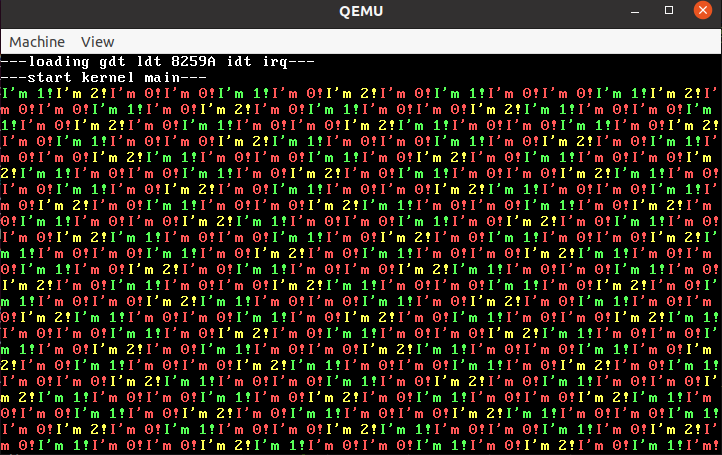
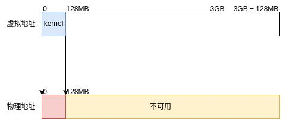
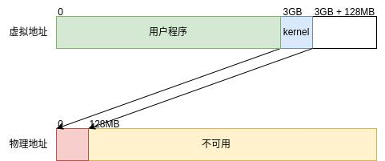

<div align="center">
    <font size="6">实验五 页表与系统调用</font>
</div>

<div align="center">
    <font size="4">谷建华</font>
</div>
<div align="center">
    <font size="4">2024-10-30 v0.6</font>
</div>

# 实验目的

1. 学习用户态执行系统调用到内核态处理的整个过程，掌握如何编写一个系统调用及参数的传递和返回值的返回
2. 学习页表的工作原理，理解如何从线性地址经过页表映射到物理地址，实现进程间的内存资源隔离
3. 学习页表项相关位的功能，掌握如何构建三级页表结构以及维护页表数据结构
4. 学习 ELF 文件的组成和格式，加载 ELF 文件格式的程序，掌握如何加载 ELF

# 实验预习内容

1. ELF 文件格式
2. 系统调用规范
3. 页表数据结构
4. 页表项的组成

# 实验内容以及步骤

1. 熟悉 ELF 格式

    (1) 修改 `loadkernel.c`，结合 ELF 格式文档，将内核文件的 ELF 信息打印到终端上并进行分析

    (2) 输出相关信息，使其能够说明加载的内核文件是一个 ELF 文件

    (3) 输出相关信息，使其能够说明运行的指令集为 i386

    (4) 输出相关信息，使其能够说明加载的程序段的个数、加载的各个段在内存中的起始地址、各个段加载的长度、各个段的读/写/可执行标志

    提示：对于步骤 1，可以临时加一个死循环以便展示，或实现一个简易的 waitkey 方法，当按下任意键后结束 elf 展示并进入内核

    注意：在这个任务点中，**不允许** 通过 `readelf` 工具进行分析，你呈现在报告中的相关结果必须来自独立编写的相关方法实现

2. 加载用户程序

    (1) 补全 `kmain.c` 中的代码，将用户进程所指定的可执行程序从文件系统中读取，解析可执行文件 ELF 信息，并根据分析结果将程序段正确加载到每个进程的地址空间中

    (2) 替换可执行程序为 `testpid.bin` 与 `testkey.bin`，分别完成 `get_pid` 系统调用及键盘输入的测试，验证两个进程是并发执行的

    提示：对于步骤 1，`fs.h` 中提供了文件读取函数 `read_file` 用于将指定文件加载到内存目标地址处

    提示：对于步骤 1，你可以参考 loader `load_kernel_elf` 的实现，但需要注意的是，加载用户程序需要考虑更多的事情

    提示：`page.h` 中提供了内核段地址映射函数 `map_kernel` 用于将线性地址 `3G~3G+128M` 映射到物理地址 `0M~128M`，你可以在其中学习如何进行页表初始化

    提示：`page.h` 中提供了一个简单的物理内存分配方法 `phy_malloc_4k`，它会分配物理地址 `64M~128M` 区间的的内存，每次分配 4KB 即一个页面大小。在本实验中，你可以不用考虑内存回收的情况

    提示：如果出现了 `page fault` 类似的信息，则很有可能是加载出错了。你可以根据报错提示的 `eip` 分析 ELF 中对应的指令，也可以借助 `gdb` 定位产生错误的指令，如通过 `watch` 对产生 page fault 的访存地址出设立硬件断点或单步执行到 `eip` 处

3. 实现系统调用

    (1) 实现内核的 `delay_ticks` 方法，使其符合 `rt/private/stdlib.h` 中说明的语义

    (2) 添加系统调用 `delay_ticks`

    (3) 添加 3 个用户进程并发执行 `delay.bin`，要求 3 个进程的 pid 分别设置为 0 1 2，你应当得到与下图类似的结果

    

    说明：对于步骤 1，你可能需要修改的文件包括以下：

    - [src/kernel/private/time.c](../src/kernel/private/time.c)

    说明：对于步骤 2，你可能需要修改的文件包括以下：

    - [include/rt/public/sys/syscall.h](../include/rt/public/sys/syscall.h)
    - [src/kernel/private/syscall.c](../src/kernel/private/syscall.c)
    - [src/rt/public/syscall.c](../src/rt/public/syscall.c)

    说明：对于步骤 3，如果执行过程出现了 `panic`，那么你的实现可能出现了问题

    提示：对于步骤 3，存在一种边界情况，即三个进程全部进入了休眠状态，你需要考虑清楚此时会产生什么问题，例如是否有谁接替了执行流，或是休眠内核直到下个中断再恢复执行

# 实验总结

1. 系统调用的入口参数是如何传入内核的？返回值又是如何返回给进程的？
2. 时钟中断和系统调用对 IDT 的初始化有什么不同？
3. 该实验中初始化内核页表和用户页表有啥区别？

# 实验参考

## 二进制文件和 ELF 文件

前面的实验已经用到了 ELF 格式, 通过 loader 加载的 kernel 就是 ELF 格式的可执行文件. 不过我们需要额外的代码来完成加载运行的过程, 因为 kernel 文件并不能像加载 loader 文件一样直接加载到指定位置然后跳过去. 这里可以直观地通过 `file` 命令比较一下 `loader.bin` 和 `kernel.bin`

```shell
$ file loader.bin | tr ',' '\n'
loader.bin:
 code offset 0x1c7+3
 OEM-ID "ForrestY"
 root entries 224
 sectors 2880 (volumes <=32 MB)
 sectors/FAT 9
 sectors/track 18
 serial number 0x0
 label: "OrangeS0.02"
 FAT (12 bit)
$ file kernel.bin | tr ',' '\n'
kernel.bin: ELF 32-bit LSB executable
 Intel 80386
 version 1 (SYSV)
 statically linked
 with debug_info
 not stripped
```

`loader.bin` 本质上是一个二进制文件, 不过带有引导信息（沿用了 boot 的引导信息所以会被识别成一个文件系统）, 所以可以通过跳转跳到文件开头就可以进行 loader 的执行。

而 `kernel.bin` 本质上是一个 ELF 可执行文件, 什么是 ELF 可执行文件？

## ELF 文件格式简介

试想一个简单的场景, 你写的代码有代码数据和普通数据, 这两部分数据是不对等的, 对于代码数据你希望它不会被改动, 所以对这部分数据不应该附上写权限, 普通数据应该附上写权限.很明显这两部分数据不应该混在一块, 而是应该分成两段存放.而且每一段都有它希望被加载到的地址, 整个一个 ELF 文件的入口地址也要指定……这些东西是需要一个数据结构进行管理, 维护每一个段所需求的信息, 然后在文件开头维护每个段的信息以及整个程序的信息等, 这个数据结构就叫 ELF 文件格式.如果你比较熟悉内核, 熟悉 execve 系统调用, 那么 [这里](https://www.bilibili.com/video/BV1wL4y1L72C/) 会让你对 ELF 文件格式有更深刻的理解。

ELF 维护了若干个程序段, 每个程序段存放了相对应的数据, 通过对数据的迁移到指定地址, 再跳到入口地址就能实现 ELF 文件的加载执行。

在知道 ELF 是啥之后, 怎么解析 ELF 文件, 将 ELF 文件的程序数据迁移就是个问题, 讲理论概念谁不会讲, 但是在具体做的时候经常会怀疑人生, 理论突然就不起用了, 那么这个时候该怎么办？**读文档**, 对于 ELF 文件格式, linux 里面有写一个专门关于它的文档, 可以通过调用 `man elf` 指令进行查看 ELF 里面的细节, 可以结合 `loadkernel.c` 代码与文档一起阅读, 分析其中的具体含义.需要注意的是 `man elf` 中是不会给出参数的具体值的, 需要阅读 `/usr/include/elf.h` 头文件获取具体的值。

`readelf` 工具可以用来分析 ELF 格式的文件. 通过调用 `readelf -a` 获取所有信息, `readelf -l` 获取程序头信息, 当你觉得你的 C 程序分析错的时候, 用 `readelf` 能够及时比对。

## 页表

在实验三, 我们实际上已经引入了页表用于扩展地址空间, 将由实模式的段偏移寻址模式变为页表寻址增加寻址能力, 但是页表映射是恒等映射, 让你们觉得好像内存哪里都能访问. 所谓恒等映射, 就是说虚拟地址和物理地址完全相同. 如果你们把页表转换机制看作是一个函数(也就是)映射, 那么

### 线性地址和物理地址

我们平时写的程序访问地址都是访问线性地址, 线性地址是不用关心物理内存的约束, 也就是意味着我们内存 128MB 的虚拟机, 你可以尝试访问 1GB 处的线性地址, 如果换成物理地址, 你只能访问 128MB 以内的地址。

我们访问线性地址, 实际上也是在访问内存中的某处的物理地址, 通过页表这个数据结构将线性地址转化为物理地址, 就仿佛带了个 VR 眼镜, 你觉得你能够看到某处线性地址, 但是它实际上被 VR 眼镜转化到某一物理地址去了, 同理你带不同的 VR 眼镜, 相同的线性地址被解析成了不同的物理地址, 每个进程能够访问到的物理内存地址范围互不相同, 除非通过特殊手段, 一个进程是不能访问到另一个进程的地址空间, 这样就实现了进程资源之间的地址空间隔离。

### VR 眼镜 cr3

在 i386 架构采用三级页表模式：页目录、页表和物理页（这个下文会慢慢解释）, cr3 中存放了页目录的地址.而这个 cr3 寄存器, 它的意义就如上文提到的 VR 眼镜, 每一个进程会维护一个 cr3 的值, 代表进程的地址空间, 每当进程发生调度的时候, 新的进程会使用 `lcr3` 函数将 cr3 寄存器值更新, 相当于将 cr3 的值 mov 过去, 具体见执行代码, 相当于换 VR 眼镜的过程。

### 线性地址转换到物理地址

好了, 到了最麻烦的一部分, 这一小节逻辑可以说是非常绕, 根据经验, 页表这一部分相当容易出现理论觉得懂了看代码觉得这不简单但是实操发现自己还是啥都不懂的情况, 为了能够让大家顺利做实验, 我们会写的尽量详细, 写代码的时候建议多读几遍这一小节。

线性地址一共有 32 位, 硬件工程师将这 32 位划分成了三个部分：

```
A linear address 'la' has a three-part structure as follows:

+--------10------+-------10-------+---------12----------+
| Page Directory |   Page Table   | Offset within Page  |
|      Index     |      Index     |                     |
+----------------+----------------+---------------------+
 \--- PDX(la) --/ \--- PTX(la) --/ \---- PGOFF(la) ----/
 \---------- PGNUM(la) ----------/
```

硬件工程师规定一个页面的大小为 4kb,4096bytes.将一个 $ 2^{32} $ 的区间划分成 $ 2^{20} $ 个页面, 通过 32 位的高 10 位和中 10 位确定线性地址对应是哪一个 **物理页面**, 然后根据低 12 位确认在页面中的偏移从而确定线性地址对应的 **实际物理地址**, 对线性地址内存的修改最终会映射到对物理内存的修改。

接下来要研究怎么根据高 10 位和中 10 位确认线性地址对应的是哪个物理页面.上文中的 cr3 寄存器就在这派上了用场, 这个寄存器里面存着的值语义是一个 **物理页面** 的首地址, 相当于对物理内存按照 4kb 为一块进行划分, 其中任意一块的 **首地址**(物理地址, 低 12 位为 0)可以成为一个合法的 cr3 值, cr3 寄存器的值的意义如下, 其中高 20 位就能表达物理页面的首地址, 低 12 位全部保留为 0。

```
+-----------20-----------+-----12-----+
|  Physical Address of   |   all 0    |
|          Page          |            |
+------------------------+------------+
```

一个页面 4kb 大, 对于 32 位机器来说一个指针的大小为 4 字节, 一个页面一共能够存放 $ 2^{10} $ 个指向下一个物理页面的“指针”, 高十位和中十位两个 10 位的数据, 分别是页目录表和页表的下标, 所以以高 10 位作为偏移量能够在 cr3 对应的物理页面找到指向（假设为）物理页面 1 首地址的“指针”, 然后再以中 10 位作为偏移量在物理页面 1 找到指向（假设为）物理页面 2 首地址的“指针”, 物理页面 2 就是线性地址对应的物理页面.cr3 对应的物理页面官方命名为 **页目录表**, 物理页面 1 官方命名为 **页表**.如果你对字典树（Trie 树）这个数据结构比较熟悉的话, 你就会发现这就是一个字符集大小为 $ 2^{10} $ 的字典树。

指向下一物理页面的“指针”在页目录表中被命名为 **页目录项** 在页表中被命名为 **页表项**, 线性地址的高 10 位又称 **页目录索引**, 中 10 位又称 **页表索引**.不过觉得页目录项和页表项区分开来非常别扭, 它们的结构和功能都完全一致, 所以我觉得可以统称为 **页表项**。

由于物理页面的首地址的 **低 12 位全是 0**, 所以硬件工程师将低 12 位重新利用起来.所以一个页表项的组成如下：

```
+-----------20-----------+-----12-----+
|  Physical Address of   |  Flag bit  |
|          Page          |            |
+------------------------+------------+
```

页表项的高 20 位就能表示下一个物理页面的物理地址首地址, 低 12 位是页表项的标志位, 我们写实验的时候只需要关心这几位:

+ `#define PTE_P 0x001` 存在位（第 0 位）, 标志着这一页表项指向的物理页面是否存在, 如果没有被置位就视为不存在。
+ `#define PTE_W 0x002` 读写位（第 1 位）, 标志着这一页是否可写, 如果被置位意味着是读写的, 如果没有被置位意味着是只读的。
+ `#define PTE_U 0x004` 用户位（第 2 位）, 标志着这一页的权限段, 如果被置位意味着是用户和内核都是可以访问的, 如果没有被置位意味着只有内核有权限能够访问。

最后梳理一下, 线性地址转化为物理地址的过程：

1. 根据 cr3 寄存器找到页目录表。
2. 根据线性地址的高 10 位找到对应的页目录项。
3. 根据页目录项的标志位判断是否有该页, 做权限的检测等, 如果非法就直接触发页面异常 `Page Fault`。
4. 如果合法, 根据页目录项找到页表。
5. 根据线性地址的中 10 位找到对应的页表项。
6. 根据页表项的标志位判断是否有该页, 做权限的检测等, 如果非法就直接触发页面异常 `Page Fault`。
7. 如果合法, 根据页表项找到物理页。
8. 根据线性地址的低 12 位找到对应的偏移, 至此一次访存完成。

可以看到其实页表本质是经过多次 `找页表-找页表项` 的循环, 对于 32 位指令集架构是重复了 2 次, 对于 64 位指令集架构就没 32 位那么漂亮了, 它转换一个线性地址可能要重复 3 次、4 次。

设置页表的过程, 本质上和硬件地址转换的过程类似, 你可以结合上面的说明和基础代码中的 `map_kernel` 函数来学习。

### TLB 缓存

根据上面的流程, 实际上为了完成线性地址一次访存, 需要访存物理内存三次, 这会极大增大运行时的开销, 所以硬件工程师将页表信息缓存下来, 这在大家的计组课上讲过叫快表 tlb, 下次访问相同物理页时会使用 tlb 的信息加速访存。

tlb 加速了访存, 但是于此同时增大的维护难度, 会出现你修改了内存中的页表项后尝试访问页表项对应的线性地址发现修改的内容没有起作用的情况.这个时候就需要将页表进行刷新保证下次访存不会出问题。

刷新命令其实很简单, 本质上是重新加载了一次 cr3, 此时硬件就会自动刷新 tlb:

```nasm
mov eax, cr3
mov cr3, eax
```

### 太抽象了？

页表机制确实刚接触时太复杂, 但是在你理解完之后你又会觉得, 就这？这是学习中不可避免的. 大家不能从文档中理解页表的最主要原因是因为没有自己代码手操过。

所以在 `pmap_test.c` 中有一个函数 `pmap_test` 能够帮助大家理解页表的相关机制, 也稍微涵盖了 tlb 缓存相关知识。

同学们可以自行调用该函数, 根据运行情况进行相关理解, 体验如何从零将一物理页映射到相应的线性地址从而能够让 os 能访存。

### 内存模型

之前我们实验的内存模型是恒等映射的。



在这个实验由于用户地址空间隔离的需要, 需要将内核程序迁移到 `3G~3G+128M` 处运行, 所以在很多方面如果需要访问物理内存地址需要访问 **物理地址 + 3GB** 的线性地址, 低 3GB 用于给用户程序用。



针对这次实验, 内核的内存模型如下：


+ 3GB \~ ?: 内核程序使用（会随着开发动态变化, 一般不会很大, 顶天 3MB）。
+ 3GB + 48MB \~ 3GB + 64MB: `read_file` 函数将文件从磁盘读出后会将文件数据加载在此处。
+ 3GB + 64MB \~ 3GB + 128MB：这段内存是空闲的, 可以用于分配给用户进程, `phy_malloc_4k` 会使用此段内存用于分配页面, 相当于分配 `64MB ~ 128MB` 的物理内存。

## 系统调用

在上一个实验中, 我们可以调用 `kprintf` 函数实现输出的功能, 我们仅仅实现了一个“虚假”的用户态, 虽然段寄存器的权限在用户态, 但是我们依然能够调用 kernel 中的函数, 但是这么做有一个弊端, 用户态下能够轻易调用内核的函数, 这是我们所不希望的, 所以我们通过页表将进程资源隔离, 这样用户进程在执行的时候就看不到内核的函数。

但是 `printf` 是需要向终端输出字符的, 但是终端显示被内核所掌控, 这个时候用户就需要使用系统调用向内核请求服务.简单理解就是用户做不了的事情, 需要向请求内核代替用户程序完成。

系统调用类似函数调用, 不过它是跨越权限的, 系统调用也有它的一套规范, 这套规范可以阅读 `man syscall` 手册查看, 下面是调用规范的部分截取。

```
Architecture calling conventions
    Every architecture has its own way of invoking and passing arguments to
    the  kernel.   The  details for various architectures are listed in the
    two tables below。

    The first table lists the instruction used to transition to kernel mode
    (which  might  not be the fastest or best way to transition to the ker‐
    nel, so you might have to refer to vdso(7)), the register used to indi‐
    cate  the system call number, the register(s) used to return the system
    call result, and the register used to signal an error。

    Arch/ABI    Instruction           System  Ret  Ret  Error    Notes
                                      call #  val  val2
    ───────────────────────────────────────────────────────────────────
    alpha       callsys               v0      v0   a4   a3       1, 6
    arc         trap0                 r8      r0   -    -
    arm/OABI    swi NR                -       a1   -    -        2
    arm/EABI    swi 0x0               r7      r0   r1   -
    arm64       svc #0                x8      x0   x1   -
    blackfin    excpt 0x0             P0      R0   -    -
    i386        int $0x80             eax     eax  edx  -
```

### 系统调用汇编命令

看最后一行, 我们可以获悉 linux 对 i386 架构是调用 `int $0x80` 汇编指令进行系统调用, 调用这条指令后就可以直接进内核态进行系统调用处理。

在之前的学习中, 我们知道 `int` 的命令实际上是触发中断, 后面跟着的数字是中断号, 所以在 i386 架构中, 系统调用本质上跟中断类似, 不过不是由硬件触发是由用户自己调用触发.如果愿意, 我们可以修改系统调用的中断号, 只要不发生冲突就行。

```c
//! 在 init_idt 中初始化系统调用
init_idt_desc(INT_VECTOR_SYSCALL, DA_386IGate, syscall_interrupt, RPL_USER);

//! NOTE: INT_VECTOR_SYSCALL 值可以任意，这次的实验用的是 linux 的 0x80
```

### 系统调用号

但是要知道内核可不只有一种功能, 如何获悉用户想要哪种功能就看下一列 `System call #`, 可以知道内核是根据 `eax` 寄存器的值获悉用户需要哪种功能, 这个值就叫系统调用号。

系统调用号可以有很多种规范, 相同的系统调用号在不同的规范下内核会实现不同的功能, 我们的实验用是自创教学用的规范, 专业标准的是叫 POSIX（可移植操作系统接口）规范, 它的一部分是对于系统调用号对应的功能进行定义, 这样只要遵循的相同的系统调用规范就能让一个相同的用户程序在不同的操作系统上运行.在 `man syscalls` 手册中有写到：linux 的系统调用号在 64 位机器上系统调用号在 `/usr/include/asm/unistd_64.h` 文件中, 数了数有四百多个, 量可以说是相当大了。

### 系统调用的其余参数

系统调用可不光有一个系统调用号, 它还可以附带一些参数, 我们继续在 `man syscall` 中阅读可以看到这么一段：

```
The second table shows the registers used to pass the system call arguments

    Arch/ABI      arg1  arg2  arg3  arg4  arg5  arg6  arg7  Notes
    ──────────────────────────────────────────────────────────────
    alpha         a0    a1    a2    a3    a4    a5    -
    arc           r0    r1    r2    r3    r4    r5    -
    arm/OABI      a1    a2    a3    a4    v1    v2    v3
    arm/EABI      r0    r1    r2    r3    r4    r5    r6
    arm64         x0    x1    x2    x3    x4    x5    -
    blackfin      R0    R1    R2    R3    R4    R5    -
    i386          ebx   ecx   edx   esi   edi   ebp   -
```

看最后一行, 可以知道系统调用是由 `ebx`, `ecx`, `edx`, `esi`, `edi`, `ebp` 这六个寄存器传递参数.不像正常的函数调用传参靠栈, 而是靠寄存器传递参数, 而且最多只能传递 6 个, 如果要传递复杂的结构可以考虑传入结构体指针的方式解决。

虽然上面的规范如此, 但是没有定死, 我们完全可以将 `ebx` 作为系统调用号, `eax` 作为参数, 不过这么做有点吃饱了撑着不去兼容规范。

### 系统调用返回值以及错误码

再看第一张表的 `Retval`, 可以获悉到系统调用也是可以有返回值的, 返回值一般放在 `eax` 寄存器, 当 `eax` 寄存器放不下的时候会将第二部分放 `edx`, 但是这种情况比较罕见, 所以暂且不用去理会。

系统调用的返回值与普通函数的返回值中不太一样的一点是它会返回错误号, 错误号是一类特殊的返回值, 当用户请求的系统调用正确时会返回 0 或系统调用规定的值, 但有错误（常见的比如文件路径不存在, 用户越权写系统文件）时系统调用会返回错误号, 错误号值的范围从-1,-2,-3...以此类推, 大概有一百来个.通过错误号, 用户可以知道自己调用系统调用触发了什么问题, 可以阅读 `man errno` 手册可以获得错误号对应的语义.在终端中输入错误命令或在平常 C 语言代码中调用 `perror` 函数输出的都是根据上一个系统调用的错误码信息输出相应的字符串。

下面的说明是基于 Linux 系统的, 用于展示相关的概念, 不过我们的实验中为了简单起见并没有实现相应的功能。

```c
$ ls
cstat  cstat.c
$ stat 114514
stat: cannot stat '114514': No such file or directory
$ cat cstat.c
// 你如果要问我怎么知道要引入这些头文件的,直接man翻手册啊
// 正经人谁背的住那么多头文件,不如直接翻手册
#include <sys/types.h>
#include <sys/stat.h>
#include <unistd.h>
#include <stdio.h>

int main()
{
    struct stat statbuf;
    stat("1919810", &statbuf);
    perror("");
}
$ ./cstat
No such file or directory
```

就如上面的例子, 两个都是访问的不存在的文件, 获取到的错误码信息为 ENOENT, 具体值在 POSIX 中值被规定成了 2, 相当于系统调用返回-2, 它的语义就是 `No such file or directory`, 所以两个命令都输出了这句话。

由于错误码有限多个, 所以同一个错误码在不同系统调用中有不同的语义, 你如果会去翻系统调用的手册的时候会经常发现 ERRORS 这一栏, 这里定义了一系列可能出现的问题以及会返回的对应错误码。

当你在终端中输入一行命令后发现它报错了, 你肯定会很疑惑它为什么会这么报错, 这个时候一种可行的做法就是使用 `strace` 命令，它会截获用户程序对应的系统调用。

```shell
$ strace stat ./114514
# strace 输出的东西太多,就截取跟114514相关的
execve("/usr/bin/stat", ["stat", "./114514"], 0x7ffc75313828 /* 66 vars */) = 0
lstat("./114514", 0x7ffca6294210)       = -1 ENOENT (No such file or directory)
write(2, "cannot stat './114514'", 22)  = 22
```

根据 strace 的结果可以知道哪些系统调用发生了异常, 上面可以知道 `lstat` 这个系统调用发生了异常, 返回了 ENOENT, 用户程序可以通过其系统调用了解其实际干了什么, 这也是一种猜测用户行为 debug 的一种方式。

### 系统调用处理逻辑

对于我们实验的代码, 系统调用分成两步处理：

+ `*` 与 syscall 同名的方法，通过头文件划分与链接手段进行隔离，在内核中，为 syscall 的实际处理方法，在用户程序中，为 syscall 调用的封装
+ `sys_*` 各个 syscall 的 handler 的入口，触发 syscall 中断后通过查表进入并转发给内核的同名处理方法

这三层在代码中可以体现, 整个中断的处理流程跟时钟中断非常类似, 还要简单。

```nasm
; trap.asm 中的系统调用处理函数
; 相比于硬件中断这段代码可太简单了
    global syscall_interrupt
syscall_interrupt:
    call    save
    sti
    call    syscall_handler
    cli
    ret
```

进内核态后先保存用户程序上下文（寄存器）, 然后调用 `syscall_handler` 函数进行处理, 处理完毕后返回用户态, 就这么简单。

`syscall_handler` 仅仅是根据系统调用号判断该用什么处理函数。

```c
//! NOTE: 这里只是提供一个例子，实际基准代码中的实现给出了更友好的实现

static ssize_t sys_get_ticks();
static ssize_t sys_get_pid();
static ssize_t sys_read();
static ssize_t sys_write();

// 这种写法钦定了 syscall_table 的第 _NR_get_ticks 项与 sys_get_ticks 函数绑定
ssize_t (*syscall_table[])() = {
  [_NR_get_ticks] sys_get_ticks,
  [_NR_get_pid] sys_get_pid,
  [_NR_read] sys_read,
  [_NR_write] sys_write,
};

//! 系统调用处理函数
void syscall_handler() {
  int syscall_id = p_proc_ready->pcb.user_reg.eax;
  ssize_t ret = (*syscall_table[syscall_id])();
  //! 将用户态的寄存器值修改，在返回用户态时返回值就自然被写到了eax 上
  p_proc_ready->pcb.regs.eax = ret;
}
```
