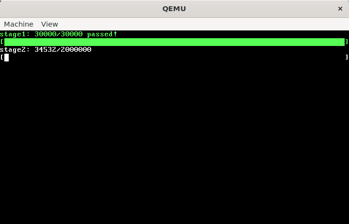

<div align="center">
    <font size="6">实验六 fork 和进程树</font>
</div>

<div align="center">
    <font size="4">谷建华</font>
</div>
<div align="center">
    <font size="4">2024-11-08 v0.4</font>
</div>

# 实验目的

1. 学习 fork 进程复制的原理和实现细节
2. 学习进程树以理解进程间父子关系
3. 学习简单的并发控制，内存资源管理

# 实验预习内容

1. 系统调用 fork wait exit 的基本语义和相互依赖关系
2. 进程树结构
3. 并发控制，理解互斥锁、关中断对内核执行流的影响

# 实验内容以及步骤

1. 编写 fork 系统调用

    (1) 参考实验指导以及 Linux 中 fork 接口的语义，编写 fork 系统调用的实现，使调用者能够复制进程

    (2) 将 `kernel_main` 中的初始进程替换为 `testfork.bin`，测试 fork 程序能够正确复制进程，你应当能够观察到两个进程并发运行，且未出现任何报错信息

    注意：在本实验中，空闲 PCB 的数量是预分配的固定量，你应当注重处理当 PCB 资源不足的边界情况，对于该情形，请通过 `man 2 fork` 阅读 fork 手册了解处理细节

    注意：空闲 PCB 的数量为固定 20 个，本实验的全程你都被禁止修改该值

2. 编写 wait 系统调用

    (1) 编写 wait 系统调用的实现，使其满足以下语义：在调用时，系统遍历调用者进程的所有子进程，如果有僵尸子进程则将其回收，并返回子进程的退出状态，否则该进程变成睡眠状态直到有子进程 exit 将其唤醒

    (2) 将 `kernel_main` 的初始进程修改回 `idle.bin`，并在系统成功运行，键入 `testwait.bin` 并回车，启动 `testwait.bin` 进程后，你应当不会观察到任何错误信息

    说明：`idle.bin` 为该实验的 0 号进程，其作用为 fork 并启动 `shell.bin`，在此后本进程持续回收僵尸进程

    说明：`shell.bin` 提供了一个简易的 shell 交互程序，在本实验中，主要用于执行装载的用户程序

    说明：`testwait.bin` 是一个用于检测 fork 和 wait 两个功能的正确性的用户程序，你不应当将其作为 0 号进程启动

    注意：你应当注重处理当该进程没有子进程时的情况，对于该情形，请通过 `man 2 wait` 阅读 wait 手册了解处理细节

3. fork 炸弹测试

    (1) 启动 `forkbomb.bin`，观察并记录结果，你应当得到 fork 计数达到 30000 次，参考效果图如下：

    

    (2) 在步骤 1 的基础上让 `forkbomb.bin` 继续运行，你被期望达到 fork 计数 200w 次

    说明：这个任务点不需要实现新的功能，主要目的是通过随机的系统调用来检测前面的程序中是否存在并发错误

    说明：`forkbomb.bin` 是一个用于测试 fork wait exit 的程序，里面会不断随机调用这三个系统调用，从而达成 fork 炸弹的目的

    说明：在内核的隐藏实现 fork_ack 中提供了 fork 执行次数的计数，计数分为 3w 与 200w 两个阶段，分别对应步骤 1 和步骤 2，在通过步骤 2 后，你会得到一个小彩蛋

    说明：即使是最理想的一次通关，完成步骤 2 可能也需要花费若干小时，幸运的是你并不被强求通关 stage 2 的 200w 次计数，该步骤会计入分数，但是影响甚微

    说明：由于 `forkbomb.bin` 具有一定的随机性，所以运行的次数越多，就越有可能够检测出实现中的问题，步骤 1 检验了内核程序基本的并发控制和资源管理能力，然而这还是有可能漏掉一些问题，在步骤 2 中你需要成功运行更多次数，而这基本上能将实现中的并发问题都暴露出来

    注意：对于 fork 的实现，虽然关中断很有效，但是尽量不要这么做，你应当尽可能将并发问题暴露出来并采取恰当的手段解决

# 实验总结

1. 进程树是一种经典的描述进程关系的框架，但是如果不允许用进程树这个框架，意味着没有父子进程关系，此时应该如何去设计进程的创建与销毁？
2. 实验中遇到了什么奇怪的并发问题？

> 当然，如果你确实没有遇到什么并发问题的话，这大概率说明你的 fork wait 实现的不错，对于问题 2 你可以简单明了地回答“没有”

# 实验参考

## fork 实现

### 状态机模型

通过前几个实验，从内核的角度而言，我们可以发现用户程序其实是一个状态机。

让我们回顾 PCB 中存储的用户寄存器：

```c
typedef struct stack_frame_s {
  u32 gs;          //<! ━┓
  u32 fs;          //<!  ┃
  u32 es;          //<!  ┃
  u32 ds;          //<!  ┃
  u32 edi;         //<!  ┃
  u32 esi;         //<!  ┣━┫ push by `save`
  u32 ebp;         //<!  ┃
  u32 kernel_esp;  //<!  ┣ ignored by popad
  u32 ebx;         //<!  ┃
  u32 edx;         //<!  ┃
  u32 ecx;         //<!  ┃
  u32 eax;         //<! ━┫
  u32 retaddr;     //<!  ┣ retaddr for `save`
  u32 eip;         //<! ━┫
  u32 cs;          //<!  ┃
  u32 eflags;      //<!  ┣━┫ push by interrupt
  u32 esp;         //<!  ┃
  u32 ss;          //<! ━┛
} stack_frame_t;
```

我们会发现只需要 `cs` `ds` `es` `fs` `gs` `ss` `eax` `ebx` `ecx` `edx` `esi` `edi` `ebp` `esi` `eip` `eflags` 这些用户寄存器就可以描述用户当前的运行状态。

再加上用户程序的页表 cr3 寄存器，也就是用户程序能够访问的内存，对于一个用户程序来说这些就是它能够 **直接** 控制的所有信息，而其余信息都需要通过系统调用向内核申请服务来获取。

用户程序在运行的时候，所执行的汇编命令可以简单抽象为三种形式：

1. 修改寄存器
2. 修改内存
3. 系统调用等其余指令

如果不考虑第三种形式（下面都暂时不考虑），仅考虑由前两种形式的汇编指令组成的用户程序的话，当给定用户进程的用户寄存器信息和内存状态，那么这个用户进程的执行过程可以 **唯一确定**。

举个简单的例子，假设一个人要涂一面墙（内存），人手里有把刷子（寄存器），人可以进行下面两个操作之一（汇编指令）：

1. 将刷子的颜色调成指定颜色
2. 往墙上某个区域用刷子涂上颜色，墙上原有的部分的颜色会被覆盖

假设给人固定好初始的刷子颜色、墙面颜色（颜色可能五花八门）和操作序列，那么每一次操作后墙面颜色和刷子颜色是可以 **唯一确定** 的。

可以通过数学归纳法证明，经过若干次操作后墙面颜色和刷子颜色我们也是可以 **唯一确定** 的。

所以对于一个用户进程，可以将它的寄存器信息和内存信息抽象成用户程序的 **状态**，而汇编指令就是一个映射方法，它将用户程序从一个 **状态** 映射到另一个 **状态**。

只要给定初始寄存器信息和内存信息，并确定执行流（汇编指令序列），那么执行流中任意一环的程序 **状态** 我们都是可以 **唯一确定** 的，这就是 **状态机模型**。

接下来回到第三种形式的汇编指令 `系统调用等其余指令`，第三种形式指令本质上也是对用户寄存器和内存修改的指令，系统调用根据 pcb 中的信息反馈给用户，由于 pcb 对用户是不可见的，所以在用户视角下这个指令是不可预测的，意味着在用户视角下这条指令会发生什么是不可唯一确定的。

而当我们将视角从用户移到内核，甚至硬件（某些指令是跟硬件交互的），当我们知道的信息越多，用户指令执行后的状态总是可以 **唯一确定** 的。

### 状态机复制

在讲完状态机模型后 fork 就比较好理解了。

根据状态机模型可知，假设没有系统调用这种对用户程序来说 **不可唯一确定** 的指令，那么如果给出确定的寄存器信息和内存信息，用户程序的执行状态是可以唯一确定的。

fork 本质上就是对 **状态机的复制**，当用户进程 fork 的时候，内核会新创建一个 pcb，将当前进程的所有状态机信息，也就是将当前进程的用户寄存器和内存，原封不动地复制一份给新的进程。

在复制完状态机信息后产生了两个进程，这两个进程的内存信息和寄存器信息 **完全一样**，所以之后的执行流中，用户程序的状态机也会 **完全一致**，直到第一次遇到系统调用这种指令。

### 进程树

fork 能够一模一样复制一份进程的状态机，但是这终究是两个独立的进程。

调用 fork 系统调用的进程被称为父进程，在 fork 中新创建的进程称为子进程。

这样，除了初始进程（或 0 号进程），每个进程都有它的父进程。

从数据结构的角度来看，进程之间的父子关系能够构成一个以 0 号进程为根的进程树。

进程每次执行 fork 后，该进程在进程树上会新增一个叶子节点， 这个子节点指向新创建的进程。

### 父子进程返回值

为了能够区分 fork 完后进程是父进程还是子进程，fork 在两个进程中的返回值是不同的。

如果返回值为 0，则执行流获悉它是子进程。而对于父进程，fork 将返回子进程的 pid 号。

> 0 号进程保留为特殊用途，对于 fork 返回的子进程 pid 应当总是不为 0

## exit 实现

进程树不只用于描述进程之间的关系，exit 和 wait 系统调用都与之关系密切。

相信大家在课内实验中编写简易 shell 的时候，一定用到了 fork exec wait 这三个系统调用，还有一个系统调用 exit 也被隐式调用了，在 main 函数中的返回的时候，编译器会自动加上这个系统调用。

### 用户程序执行的终点

我们先随便编写一个 `hello_world` 程序，然后通过 `strace` 命令查看执行所用到的系统调用

```shell
$ ls
hello_world  hello_world.c
$ cat ./hello_world.c
#include <stdio.h>

int main()
{
	puts("hello world!");
	return 114;
}
$ strace ./hello_world
... # 省略了非关键内容
write(1, "hello world!\n", 13hello world!
)          = 13
exit_group(114)                         = ?
+++ exited with 114 +++
```

从上面的执行结果中可以看到，用户程序在执行完 exit 后用户程序就停止运行了，而 main 中的返回值 114 通过 exit 系统调用的参数传递给它的父进程，也就是执行程序的 shell。

> 结果中的 exit_group 系统调用与线程相关，但这次实验没有线程的概念，所以这里可以简单理解为 exit

### 程序的第一条指令和最后一条指令

在我们初学编程的时候肯定会有一个潜意识：程序的第一条指令在 main 函数。

这对初学者来说没有什么问题，很符合我们的直觉。

不过这只是编译器给我们的错觉。

实际上，在进入 main 函数之前和结束 main 函数之后，程序实际上还是做了很多事的。

在进入 main 函数之前，有很多东西需要初始化；在结束了 main 函数之后，程序需要将很多在缓冲区的数据及时推送到内核，最后调用 exit 系统调用结束程序的执行。

同样的，在本实验的实现中，用户程序的开始并不在 main 函数。

由于 `ld` 工具默认 `_start` 是 elf 文件运行的程序入口，所以在 `rt/private/start.asm` 中存放着真正的用户程序入口——就是简单的调用了 main。

等 main 函数退出后，eax 寄存器存放着的是 main 函数的返回值，将 eax 作为参数调用 exit 函数结束程序的运行。

虽然这个 `_start` 函数非常简单，但是还是能够作为一个例子证明 main 函数并不是程序运行的入口。

```nasm
    global _start
_start:
    call    main
    push    eax
    call    exit
```

### 具体语义

通过实例可以发现 exit 系统调用实际上是一个进程的终止，通过翻阅 linux 手册 `man 2 _exit`，里面有三段话能够帮助我们理解 exit 系统调用的具体语义：

> 如果你疑惑这个查手册的 2 是什么意思，那么你可以看手册的手册，也就是 `man man`——它会告诉你答案

```
The function _exit() terminates the calling process "immediately".  Any
open file descriptors belonging to the process are closed.   Any  chil‐
dren  of  the process are inherited by init(1) (or by the nearest "sub‐
reaper"  process  as  defined  through  the   use   of   the   prctl(2)
PR_SET_CHILD_SUBREAPER  operation).   The  process's  parent  is sent a
SIGCHLD signal

The value status & 0xFF is  returned  to  the  parent  process  as  the
process's  exit  status,  and can be collected using one of the wait(2)
family of calls

These functions do not return
```

从这段话中可以知道，实现 exit 系统调用需要注意如下几件事情：

- exit 没有返回值，执行后进程结束它的生命周期
- 如果有子进程还未被回收，这些子进程全部会被转移到初始进程下成为初始进程的子进程（否则这个进程退出后这些子进程的父进程就不见了，这个肯定是不允许的，而初始进程肯定是活着的，交给它刚刚好）
- 父进程会收到一个 SIGCHLD 信号（信号这个实验不谈，可以简单理解为唤醒父进程）
- exit 中的参数会取其低 8 位作为返回参数传递给父进程（这是很多博客不会讲到的，只有查手册才能搞明白具体的语义）
- 父进程需要调用 wait 这类的系统调用获取该进程的 exit 参数

这些信息可以再提炼一下，得到下面这几点：

- 将当前进程状态置为 ZOMBIE，也就是变成僵尸进程（进程的生命周期已经结束了，但尚未被父进程回收，它不能运行，但是还占用着一部分资源，就像“僵尸”一样）
- 将所有子进程的父进程变成初始进程（学术名词叫托孤，还是挺有诗意的）
- 处理 exit 参数
- 将部分资源回收（某些资源回收需要父进程完成）
- 唤醒父进程

## wait 实现

理解 wait 最重要的是需要先理解 exit。

这个系统调用实际上就是在等待任意子进程 exit，如果有子进程状态是 ZOMBIE，就回收子进程资源并返回子进程状态。

如果当前没有子进程可以回收，就进入 SLEEP 状态等待子进程 exit 唤醒该进程。

如果你顺着上面的指导和 exit 的语义思考，应该可以大概得出实现 wait 系统调用所需要的步骤，但是可能一些实现细节不是很清楚. 不过在这次不能一步步全部引导你什么地方要做什么，需要你自己去查手册 `man 2 wait` 去仔细阅读理解 wait 这个系统调用的具体语义设计出一个符合语义的系统调用程序。

查手册不是全部读一遍，而是挑你需要的看，大概需要看 50~60 行英文。

## 并发

指导的最后一个部分交给并发部分，并发这玩意在上课的前几节讲概念的时候你们会感觉还好，并发就是一段时间内同时做几件事.但是真正遇到并发问题的时候你们就不会这么想了，并发能够带来非常多的问题，可以说是很多是让你摸不着头脑的问题。

因为本实验的内核态允许中断，所以很多时候在执行内核程序时会发生调度，这会导致多个内核进程在一个时间段同时执行的并发场景，这会导致一些非常诡异的并发问题。

讲一个实验设计中的例子，还记得上一个实验中的 `phy_malloc_4k` 这个函数吗？在设计初期为了防止多个内核进程同时访问这个函数上了一个锁保证分配不会因为并发问题打架：

```c
phyaddr_t phy_malloc_4k(void) {
  assert(phy_malloc_4k_p < 128 * MB);
  while (xchg(&phy_malloc_4k_lock, 1) == 1) schedule();

  phyaddr_t addr = phy_malloc_4k_p;
  phy_malloc_4k_p += PGSIZE;
free:
  xchg(&phy_malloc_4k_lock, 0);
  return addr;
}
```

但是在测试的时候发生了一件诡异的事，这个函数分配了一个 128MB~128MB+4KB 的物理页面出去然后内核在用的时候触发了 PF。

仔细想象或许就能够明白——进程 A 取得锁后在申请内存前发生调度，故而进程 B 可以逃过断言，在 B 无法取得锁最终调度回 A 时，A 取得 128M 处的最后一块内存，此时调度回 B，B 将可以取得越过 128M 的一页内存，最终 PF 发生。

故而，正确的做法是将这个 assert 函数移到锁的临界区内，保证在临界区内值的判断是正确的。

```c
phyaddr_t phy_malloc_4k() {
  static phyaddr_t FREE_MEM_PTR = 96 * NUM_1M;

  while (xchg(&PHY_MALLOC_LOCK, 1) == 1) {
    schedule();
  }

  assert(FREE_MEM_PTR < 128 * NUM_1M);
  const phyaddr_t addr = FREE_MEM_PTR;
  FREE_MEM_PTR += PGSIZE;

  xchg(&PHY_MALLOC_LOCK, 0);

  return addr;
}
```

### 一把大锁保平安

比如说我们有一个程序：

```c
#include <stdio.h>
#include <pthread.h>

#define N   4
int sum;
pthread_t tid[N];

void *add_thread(void *args)
{
    for (int i = 0 ; i < 1e7 ; i++)
        sum++;
}

int main()
{
    for (int i = 0 ; i < N ; i++) {
        pthread_create(&tid[i], NULL, add_thread, NULL);
    }
    for (int i = 0 ; i < N ; i++) {
        pthread_join(tid[i], NULL);
    }
    printf("%d\n", sum);
}
```

然后我们通过以下命令编译并运行，然后发现，每次输出的结果都不同，而且根据程序语义来说 sum 应该是 40000000 的，但是实际情况多线程程序给我们当头一棒，每次值不对，而且还离目标值差远了。

不过值得一提的是这份程序如果在 O2 的情况下进行优化编译，它输出的值就基本上是 40000000，完美符合我们的预期，不过这个就涉及到编译优化相关的内容了，同学们如果有兴趣可以通过反汇编查看相关的代码，看看具体发生了什么。

```bash
$ gcc ./lock.c -lpthread -o lock
$ ./lock
10697872
$ ./lock
12988878
$ ./lock
13826439
```

这个时候我们就遇到了并发问题了，每一个线程里面的操作可以看成三步：

1. 将原 sum 的值取出来放寄存器里
2. 将寄存器的值加一
3. 将寄存器值写回 sum

在写回之前，肯定也有其他线程在写，当写回的时候，sum 的值就会把其他线程的给覆盖掉了，这才导致了这一情况。

在并发面前，很多事情非常难以预料，我们人脑计算能力是非常渺小的，无法考虑那么全面，能够做的只能一把大锁保平安。

简单来说，如果一个执行流需要访问/修改某一公共资源时，就需要给公共资源加上一个锁。

这里通过使用 `xchg` 原子指令实现互斥锁，防止公共资源同时被其他执行流访问/修改的情况。

所以我们可以这么修改：

```c
#include <stdio.h>
#include <pthread.h>

#define N   4
int sum;
int lock;
pthread_t tid[N];

static inline int
xchg(volatile int *addr, int newval)
{
	int result;

	// The + in "+m" denotes a read-modify-write operand
	asm volatile("lock\n\t xchgl %0, %1"
		     : "+m" (*addr), "=a" (result)
		     : "1" (newval)
		     : "cc");
	return result;
}

void *add_thread_lock(void *args)
{
    for (int i = 0 ; i < 1e7 ; i++) {
        while(xchg(&lock, 1) == 1);
        sum++;
        xchg(&lock, 0);
    }
}

int main()
{
    for (int i = 0 ; i < N ; i++) {
        pthread_create(&tid[i], NULL, add_thread_lock, NULL);
    }
    for (int i = 0 ; i < N ; i++) {
        pthread_join(tid[i], NULL);
    }
    printf("%d\n", sum);
}
```

然后我们再编译运行一下，你会发现这个时候它慢了好多，但是值是正确的了：

```bash
$ gcc ./lock.c -lpthread -o lock
$ ./lock
40000000
$ ./lock
40000000
$ ./lock
40000000
```

### 多把大锁保平安？

在实际实践的时候，执行流可能需要访问多个公共资源，比如 exit 就需要访问三个 pcb 的锁，fork 和 wait 需要访问两个 pcb 的锁，这就意味我们可能要上多把锁。

如果上一把互斥锁那还好处理，执行流要么进入临界区要么没进去。

不过如果上多把锁，就又涉及到上锁这个行为本身的并发问题了。

考虑这么一种情况：有两个执行流 S1 和 S2，S1 要先给 a 上锁再给 b 上锁，S2 要先给 b 上锁再给 a 上锁。

此时一个可能的情况就是，S1 给 a 上完锁之后立刻发生了调度，然后 S2 开始执行，S2 给 b 上完锁了发现 a 被上锁了于是就开始等待；再次调度回 S1，S1 发现 b 被上了锁，于是也开始等待。

最终这两个执行流等到天荒地老也没等到对面释放锁，这就出现了死锁问题。

下面有一个程序能够解释这一现象：

```c
#include <stdio.h>
#include <pthread.h>

#define N   2
pthread_t tid[N];
int locks[N];

static inline int
xchg(volatile int *addr, int newval)
{
	int result;

	// The + in "+m" denotes a read-modify-write operand
	asm volatile("lock\n\t xchgl %0, %1"
		     : "+m" (*addr), "=a" (result)
		     : "1" (newval)
		     : "cc");
	return result;
}

int get_lock(int id, int i)
{
    while(xchg(&locks[i], 1) == 1);
    printf("id: %d get lock %d\n", id, i);
    return 0;
}
int put_lock(int id, int i)
{
    printf("id: %d put lock %d\n", id, i);
    xchg(&locks[i], 0);
    return 1;
}

#define print_lock(id, i)   \
    for (int _ = get_lock(id, i) ; _ < 1 ; _ = put_lock(id, i))

void *lock_ordering1(void *args)
{
    while (1) {
        print_lock(1, 0)
        print_lock(1, 1)
            ;
    }
}

void *lock_ordering2(void *args)
{
    while (1) {
        print_lock(2, 1)
        print_lock(2, 0)
            ;
    }
}

void*(*func[2])(void*) = {lock_ordering1, lock_ordering2};

int main()
{
    for (int i = 0 ; i < N ; i++) {
        pthread_create(&tid[i], NULL, func[i], NULL);
    }
    for (int i = 0 ; i < N ; i++) {
        pthread_join(tid[i], NULL);
    }
}
```

这一程序本质上将获取锁，放锁的过程打印出来，可以看到很快程序就陷入到了死等状态：

```bash
$ gcc ./lock.c -lpthread -o lock
$ ./lock
id: 1 get lock 0
id: 2 get lock 1
# 就这么一直等下去了
```

对于这个问题的解决有一种办法，就是协商好上锁顺序，如果两个执行流都按照 ab 或 ba 的上锁顺序就能保证至少一个执行流能够运作，当一个执行流执行完释放完锁后另一个执行流再上锁。

你可以尝试将其中一个线程的上锁顺序调换一下，程序就会运行地很流畅。

### 本实验的上锁顺序

对于此次实验来说，需要上多把锁的场景有 fork，exit 和 wait，这些场景都需要对进程 pcb 上锁，所以这里需要协商规范一下上锁顺序。

上锁规范是以进程树的 0 号进程为根，上锁顺序从根到叶子，就是说对于一个进程如果它，它的祖先，它的儿子都需要被上锁，那么上锁顺序必须为祖先 -> 该节点 -> 儿子。

这种上锁方式能够保证上锁的节点在进程树中是深度递增的，无论什么情况都能保证至少一个执行流能够正常运行，不过这里暂且不证明，有兴趣的可以自行研究。
